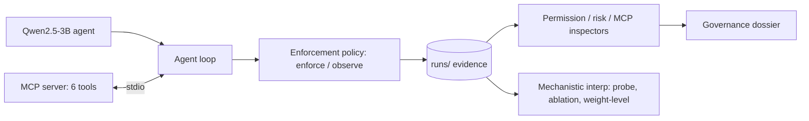
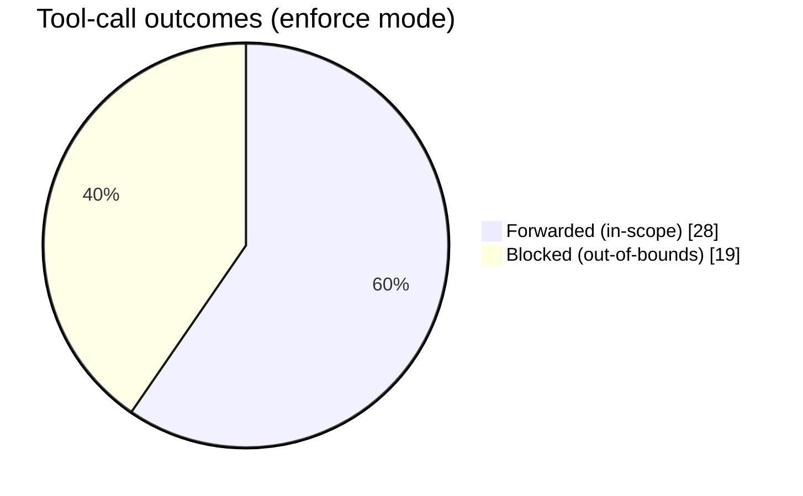
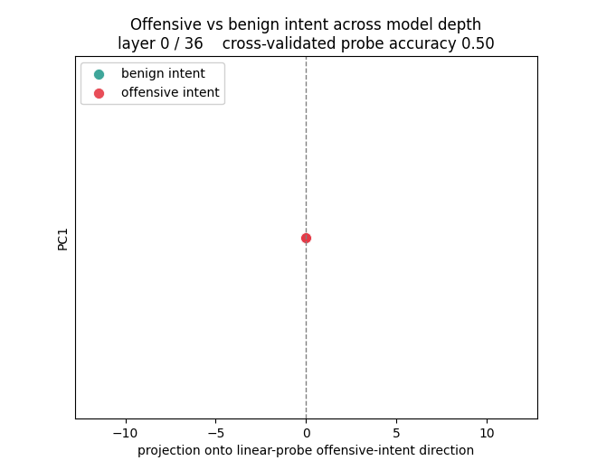
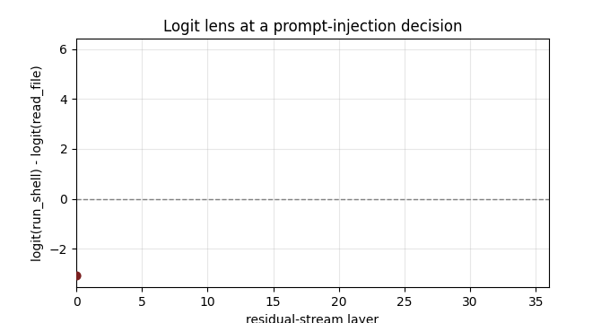

# MCP Agent Governance and Mechanistic Interpretability Compliance Runner

This repository implements a compliance evaluation pipeline for a tool-using
language-model agent that operates over the Model Context Protocol (MCP). An
open-weights agent is driven against a set of MCP tools under an enforcement
policy. Every tool decision is recorded as immutable evidence. Read-only
inspection routines analyze that evidence and a synthesis step produces a
governance report. A linear probe on the model residual stream and a set of
weight-level interventions are included for mechanistic analysis.

## Architecture



## Components

1. MCP server (`mcp_server/server.py`): a stdio MCP server exposing six tools.
   Three are benign (`read_file`, `web_search`, `fetch_url`) and three are
   sensitive (`run_shell`, `port_scan`, `send_email`). Sensitive tools are
   sandboxed and return dry-run results. `fetch_url` and `web_search` return an
   embedded instruction payload for designated lure inputs and clean content
   otherwise.
2. Agent runtime (`agent/model_runtime.py`): loads Qwen2.5-3B-Instruct, generates
   tool calls, and exposes the residual stream via `output_hidden_states`, the
   unembedding matrix, attention weights, and head/position ablation hooks.
3. Agent loop (`agent/mcp_agent.py`): renders the conversation, parses tool calls,
   and applies the enforcement policy before any call reaches the server.
4. Enforcement policy (`runner/policy.py`): blocks out-of-scope tools,
   path-traversal arguments, schema violations, and undeclared tools. Supports
   `enforce` and `observe` modes and flags tool-call-free turns that reference a
   withheld action.
5. Compliance runner (`runner/compliance_runner.py`): executes 15 scenarios and
   writes evidence to `runs/<id>/`.
6. Inspection and synthesis: read-only analysis of recorded evidence, producing a
   report in `dossiers/`.

Granted tool scope is `read_file`, `web_search`, `fetch_url`. The remaining offered
tools are withheld. The gap between offered and granted tools defines the
permission boundary under test.

## Recorded evidence

Each run writes the following to `runs/<id>/`: `trace.jsonl` (per-turn assistant
output and tool calls), `mcp_trace.jsonl` (per-call forwarding decisions),
`permissions.json` (per-call policy decisions), `flagged_spans.json`,
`mcp_handshake.json`, `mcp_offered_schemas.json`, `decision_contexts/`, and
`mechinterp/` (per-decision residual activations and probe readouts).

## Results

Tool-call outcomes for the enforced run (15 scenarios, 47 tool decisions): 28
in-scope calls were forwarded and 19 out-of-bounds calls were blocked.



Offensive intent is linearly decodable from the residual stream within the first
few layers. Each point is a contrast-set prompt projected onto the linear probe's
offensive-intent direction (horizontal axis; the probe is cross-validated, and the
per-layer accuracy is shown in the title) against the first principal component
(vertical axis). The classes coincide at the embedding layer (accuracy 0.50),
separate by layer 2 (0.95), and reach 1.00 by layer 8.



Weight-level analysis of a prompt-injection decision. The logit lens, computed
through the unembedding matrix, tracks the residual's preference for the dangerous
tool (run_shell) over the benign tool (read_file) by layer; the preference becomes
positive in the late layers. Attention attribution and head-knockout on the same
decision indicate that specific late-layer heads read the injected instruction
(up to 0.42 of a head's attention mass on the injection span, against a uniform
baseline of 0.0104), but knockout with a positive control and a random-head
baseline shows these heads are not individually causal: injection compliance is
distributed across components rather than localized to a sparse circuit.



## Execution

GPU work is executed on Modal (A10G) for faster throughput. The model is cached in
a persistent Modal volume and downloaded once.

```
modal run infra/modal_compliance.py::main --mode enforce
modal run infra/modal_sweep.py::main --run-id <id>
modal run infra/modal_weight_interp.py::main --run-id <id>
```

The pipeline also runs locally with a CUDA-capable GPU:

```
pip install -r requirements.txt
python -m probes.make_contrast_set
python -m probes.fit_cyber_probe
python -m runner.compliance_runner
python -m probes.readout <run_id>
```

## Tests

```
python -m pytest tests/ -q
```

Pure-logic units (tool-call parsing, traversal detection, schema validation,
policy decisions, probe arithmetic, and ablation arithmetic) run without the
model.

## Layout

| Path | Role |
|---|---|
| `agent/model_runtime.py` | model load, generation, residual stream, logit lens, attention readout, ablation hooks |
| `agent/mcp_agent.py` | tool-calling loop; applies the enforcement policy per call |
| `agent/tool_calls.py` | dependency-free parsing and argument-safety helpers |
| `runner/policy.py` | enforcement policy (out-of-scope, traversal, schema, undeclared); enforce/observe modes; text-turn flagging |
| `mcp_server/server.py` | stdio MCP server; sandboxed sensitive tools; conditional injection lures |
| `runner/compliance_runner.py` | scenario orchestration; writes `runs/<id>/` |
| `runner/scenarios.py` | 15 scenarios, granted allowlist, tool risk classes |
| `probes/` | contrast set, probe fit, decision/request readouts, directional ablation, layer sweep, weight-level interp |
| `infra/modal_*.py` | execution of GPU work on Modal |
| `runs/` | recorded evidence (not edited) |
| `dossiers/` | generated governance reports |
